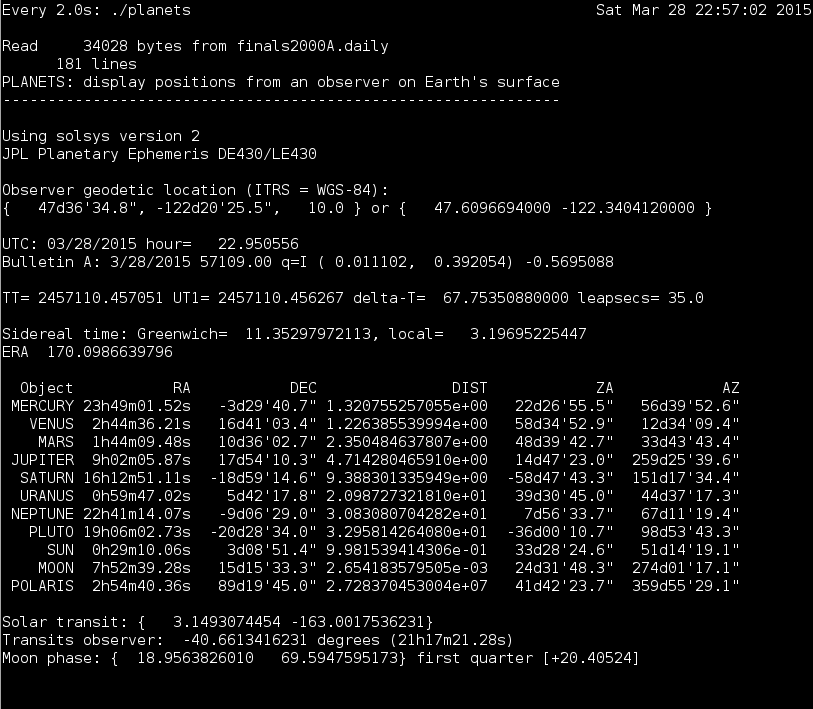

# astro

Basic vector astronomy using NOVAS

"The Naval Observatory Vector Astronomy Software (NOVAS) is a source-code
library in Fortran, C and Python that provides common astrometric quantities
and transformations. It can supply, in one or two function calls, the 
instantaneous celestial position of any star or planet in a variety of 
coordinate systems."
_NOVAS C 3.1 Guide_

This project uses the NOVAS C-library to calculate the sky positions of 
the planets, Sun and Moon, from an observer at a fixed location on Earth.

It leverages the general purpose planet ephemeris file DE430, published
15-Aug-2013 by the National Aeronautics and Space Administration (NASA)
Jet Propulsion Laboratory (JPL). Following the instructions below, you 
will download the text files that make up DE430, along with Fortran
code that parses these and produces a binary ephemeris file for your
architecture. Once the binary DE430 is built and tested, you will use
it to build an example program in the NOVAS C distribution.

Finally, a small application included in this project, `planets`, can
be built to demonstrate some of the capabilities of NOVAS.

The NOVAS C distribution and JPL Ephemeris and utility software are
free to download from the publishers. Neither is provided here.



### Instructions for creating binary JPL Ephemeris DE430

These instructions were tested on FC19 and FC20 x86_64 Linux. 

### NOVAS References

For your reference... and to make sure things haven't changed too much.

[Naval Observatory Vector Astronomy Software](http://aa.usno.navy.mil/software/novas/novas_info.php)

[C Edition](http://aa.usno.navy.mil/software/novas/novas_c/novasc_info.php)

[Tarball](http://aa.usno.navy.mil/software/novas/novas_c/novasc3.1.tar.gz)


### Install Fortran Compiler

Assumes that you have the typical GCC tools already. Also add the
cURL library and development headers (for Bulletin A fetching code).

`sudo yum install libgfortran gcc-gfortran libcurl libcurl-devel`


### Set Up Development Tree

Starting from this directory...

```
mkdir -p ephemeris/ascii/de430
mkdir -p ephemeris/fortran
curl -O http://aa.usno.navy.mil/software/novas/novas_c/novasc3.1.tar.gz
tar -xzf novasc3.1.tar.gz
cd ephemeris/fortran
for p in $(curl --list-only ftp://ssd.jpl.nasa.gov/pub/eph/planets/fortran/); do \
	curl -O ftp://ssd.jpl.nasa.gov/pub/eph/planets/fortran/$p; \
    done
cd ../ascii/de430
for p in $(curl --list-only ftp://ssd.jpl.nasa.gov/pub/eph/planets/ascii/de430/); do \
	curl -O ftp://ssd.jpl.nasa.gov/pub/eph/planets/ascii/de430/$p; \
    done
```

### Build asc2eph

`cd ../../fortran`

The instructions in `userguide.txt` are authoritative. These instructions were
derived from the instructions dated "24 March 2013".

`vim testeph.f jplsubs.f`

Cut six subroutines from `testeph.f`, paste into a new file named `jplsubs.f`

1. FSIZER3
2. PLEPH
3. INTERP
4. SPLIT
5. STATE
6. CONST

Delete two additional subtroutines from `testeph.f`

1. FSIZER1
2. FSIZER2

After these edits, `testeph.f` will only include the main code (no subroutines).

In `jplsubs.f`, in `SUBROUTINE FSIZER3`, change the line:

```
       NRECL=
```
       
To:

```
      NRECL=4
```

NOTE: Leading whitespace in Fortran is significant, so remove *one* of
the indention spaces so it has a 6-space indention.

Further down in `SUBROUTINE FSIZER3`, change the line:

```
      KSIZE =
```

To:

```
      KSIZE=2036
```

Search for `CALL FSIZER3` and uncomment the line (by deleting the 'C' in column 1).

Save and quit vim. Edit `asc2eph.f`

`vim asc2eph.f`

Find the line:

```
C      PARAMETER ( NRECL = 4 )
```

Uncomment it (delete the 'C' in col 1)

Create a `Makefile`. Here's mine:

```
FC = gcc
BUILD ?= debug
LDFLAGS = -lm -lgfortran

TARGETS = asc2eph testeph
SOURCES = asc2eph.f testeph.f jplsubs.f

ifeq ($(BUILD),debug)
FFLAGS += -g
else
ifeq ($(BUILD),release)
FFLAGS += -O3 -DNDEBUG
endif
endif

.PHONY: all clean

all: $(TARGETS)

asc2eph: asc2eph.o

testeph: testeph.o jplsubs.o

clean:
	@rm -f $(TARGETS) *.o

# vim: set noexpandtab tabstop=4 shiftwidth=4 softtabstop=4:
```

Set the environment to build in debug mode (optional)

`export BUILD=debug`

Build

`make`

### Generate JPLEPH

Generate the binary ephemeris

`cat ../ascii/de430/header.430_572 ../ascii/de430/asc*.430 | ./asc2eph`

Confirm the file is created

`ls -al JPLEPH`

(It will be about 100M in length)

Test it!

`cat ../ascii/de430/testpo.430 | ./testeph`

The output will display (among other things) the _jpl values_, _user value_ and _difference_.

A successful run will have no difference greater than about `0.71054E-14`

# Congratulations!

You now have the binary ephemeris for your platform.

### Build NOVAS example.c

We are still in the `ephemeris/fortran/` directory...

```
cp jplsubs.f ../../Cdist
cd ../../Cdist
```

Create a symlink to JPLEPH

`ln -s ../ephemeris/fortran/JPLEPH`

Fix `jplint.f` (to allow 572-parameters in the ephemeris)

`vim jplint.f`

Look for two locations where `cdim` is initialized to 400. Look for lines matching:

```
      PARAMETER (cdim = 400)
```
      
Change the `400` to `600`

Build `checkout-stars`

`make checkout-stars`

Run `checkout-stars`

`./checkout-stars > checkout-mp-my.txt`

Compare with USNO output

`diff -U0 checkout-stars-full-usno.txt checkout-mp-my.txt`

Because these test vectors were created with DE405, you'll have *small*
differences in the numeric output. Here's what my diff output looks like:

```
--- checkout-stars-full-usno.txt        2011-01-21 14:48:11.000000000 +0000
+++ checkout-mp-my.txt  2015-03-13 22:26:57.000000000 +0000
@@ -1,2 +0,0 @@
-JPL Ephemeris DE405 open. jd_beg = 2305424.50  jd_end = 2525008.50
-
@@ -4 +2 @@
-RA =  2.446988922  Dec =  89.24635149
+RA =  2.446988912  Dec =  89.24635149
@@ -14 +12 @@
-RA =  2.446988922  Dec =  89.24635149
+RA =  2.446988912  Dec =  89.24635149
@@ -24 +22 @@
-RA =  2.509480139  Dec =  89.25196813
+RA =  2.509480137  Dec =  89.25196813
@@ -27 +25 @@
-RA =  5.531195904  Dec =  -0.30301961
+RA =  5.531195903  Dec =  -0.30301961
@@ -34 +32 @@
-RA =  2.481177533  Dec =  89.24254404
+RA =  2.481177531  Dec =  89.24254404
```

### Build example

In `example.c`, there's a few places where you need to adjust the
source code to use solsys version 2. These are documented in the code,
but I'm also providing a quick list here.

Search for, and delete the following line:

```
#include "eph_manager.h" /* remove this line for use with solsys version 2 */
```

Delete the block of code following the comment:

```
/*
   Open the JPL binary ephemeris file, here named "JPLEPH".
   Remove this block for use with solsys version 2.
*/
```

Uncomment the block of code following the comment:

```
/*
  Uncomment block below for use with solsys version 2
  Prints alternate header
*/
```

Delete the following line:

```
   ephem_close();  /* remove this line for use with solsys version 2 */
```

Save and quit. Then build:

`make example`

_Ignore a few unused variable warnings_

Run the example

`./example > example-my.txt`

Compare with USNO output

`diff -U0 example-usno.txt example-my.txt`

Again, ignore small differences in the numbers. The USNO data was generated
from an older ephemeris. Here's my output:

```
--- example-usno.txt    2011-01-21 14:48:10.000000000 +0000
+++ example-my.txt      2015-03-13 22:37:39.000000000 +0000
@@ -1 +1 @@
-JPL ephemeris DE405 open. Start JD = 2305424.50  End JD = 2525008.50
+Using solsys version 2, no description of JPL ephemeris available
@@ -14 +14 @@
-  11.8915479153          37.6586695456
+  11.8915479153          37.6586695455
@@ -17,3 +17,3 @@
-  17.1390774264         -27.5374448869         0.002710296515
-  17.1031967646         -28.2902502967         0.002703785126
-  17.1031967646         -28.2902502967         0.002703785126
+  17.1390775046         -27.5374455772         0.002710296520
+  17.1031968434         -28.2902509919         0.002703785130
+  17.1031968434         -28.2902509919         0.002703785130
@@ -22 +22 @@
-  81.6891016502         219.2708903405
+  81.6891016821         219.2708890772
@@ -28 +28 @@
- 148.0032235906           1.8288284075         1.664218258879
+ 148.0032234980           1.8288285255         1.664218258927
```

# Congratulations!

You have built and tested NOVAS with JPL DE430.

## Further Reading

`Cdist/NOVAS_C3.1_Guide.pdf`

Documents most of the functions in the NOVAS library.

